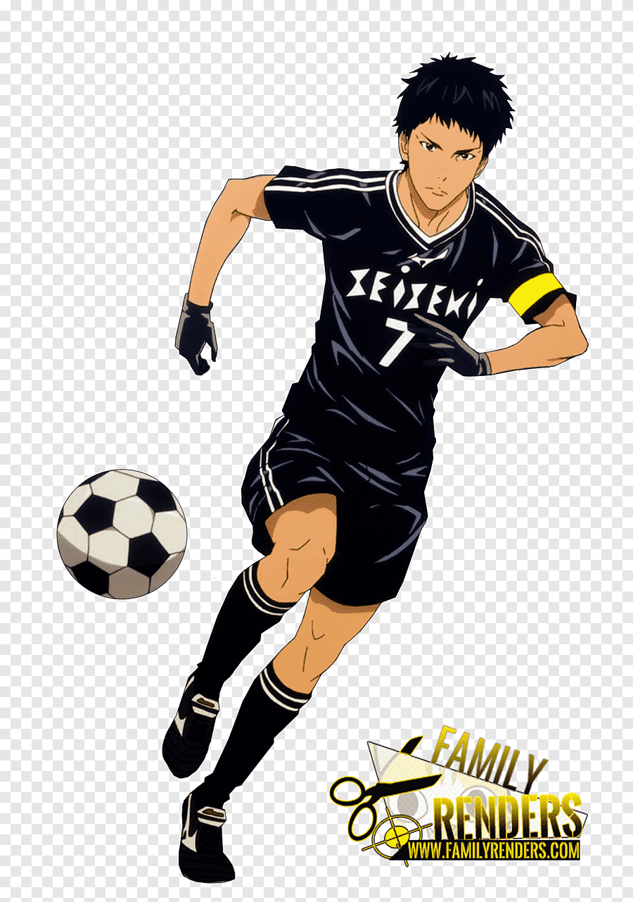

<h1 align="center"><em>Hello!</em> </h1>
<h3 align="center"><b><em>VALDO</em></b> here 🇲🇬️😃️. <code>Mathematics and computer science student.</code></h3>
<h3 align="center"><code>I'm self-taught programmer, doing my best to improve my skills.</code></h3>

<table align="center" style="background-color: black;">
    <tr>
        <td>
            <h2>🔭️  <u><b>Interested in</b></u></h2>
            <ul>
                <li>🎮️ Game Development</li>
                <li>🌐️ Web Development</li>
                <li>🇲🇬programming contest</li>
                <li>📖 reading</li>
            </ul>
        </td>
        <td></td>
    </tr>
    <tr>
        <td>
            <h2>✨️ <u><b>Outlets</b></u></h2>
            <ul>
                <li>📺️ Anime and Manga</li>
                <li>⚽ Football</li>
            </ul>
        </td>
<td></td>
    </tr>
</table>

<table align="center">
    <tr>
        <td>
            <h2 align="center">💻️  <b>Programming languages</b></h2> 
            

            
            
            
            

            
            
            

        </td>
        <td rowspan="2">
            <h2 align="center">🛠️ <b>Tools</b></h2> 
            

            
            
            
            

            
            
            
            
            
            

        </td>
    </tr>
    <tr>
        <td align="center"></td>
    </tr>
</table>

<h2 align="center"><code>Thanks for your visit. Have a good day!</code> 😁️</h1>
